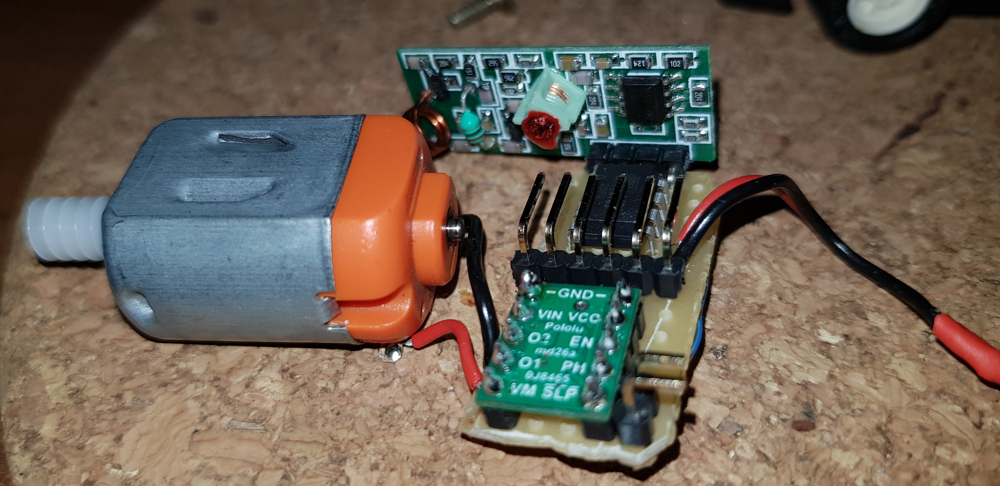

# RC-car

Favourite childhood toy radio controlled transformation.
Schematics are trivial. Datasheets are useful. Some infos below. I hope you enjoy it.

DRV8838:
https://www.pololu.com/product/2990
http://www.ti.com/lit/ds/slvsba4e/slvsba4e.pdf

Arduino Mega programmer
https://brauniusengineering.com/attiny85-with-arduino-mega/

Li-Po 3.7v 250mAh:
https://www.conexelectronic.ro/ro/acumulatori/228-ACUMULATOR-LI-POLYMER-3-7V-250MAH.html?search_query=+Li-Po+3.7v+250mAh&results=1

RF modules and library:
https://www.pjrc.com/teensy/td_libs_VirtualWire.html
https://lastminuteengineers.com/433mhz-rf-wireless-arduino-tutorial/
http://www.airspayce.com/mikem/arduino/RadioHead/

Antenna length calculator:
http://www.csgnetwork.com/antennagenericfreqlencalc.html

Pins position in below picture have been changed. actually I changed the board design. Final implementation in pic above.

